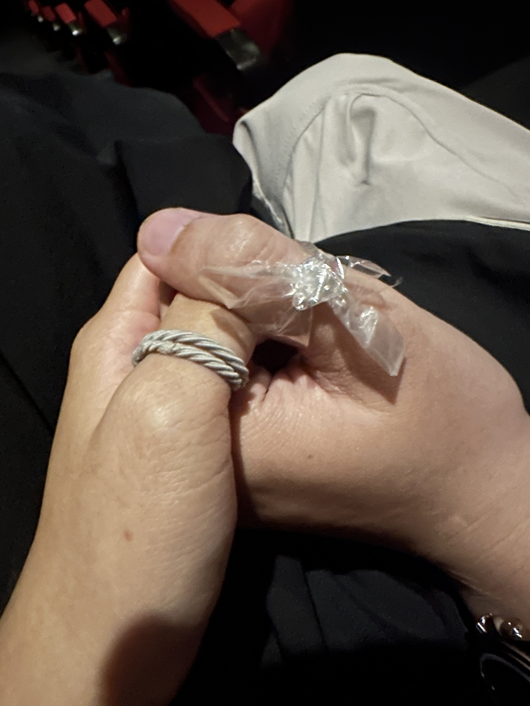
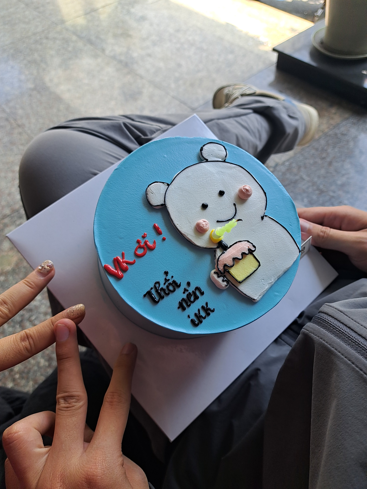

## 🎂 Một Sinh Nhật Đặc Biệt – Lần Đầu Có Em

Có lẽ sẽ không có sinh nhật nào như năm nay – không phải vì những món quà lớn, hay tiệc tùng linh đình – mà bởi vì đây là **lần đầu tiên mình đón sinh nhật của chính mình… cùng với người mình yêu.**

Mình nhớ, lần đầu gặp em cũng vào một ngày sinh nhật – **sinh nhật của em, ngày 16/11**. Hôm đó thật sự là một ngày tuyệt vời, nụ cười em cũng nhẹ nhàng. Khi đó, mình không biết rằng, chỉ một khoảnh khắc ấy thôi, lại là khởi đầu cho một điều thật đẹp sau này.

Và rồi, một vòng tròn lặng lẽ khép lại – **ngày sinh của em là ngày mình gặp được em**, còn **ngày sinh của mình là lần đầu em hiện diện bên cạnh – với tư cách là "người yêu".** Đôi khi, định mệnh không cần phải rực rỡ, chỉ cần vừa đủ ấm để ta không quên.

Năm nay, không cần ước nhiều. Vì khoảnh khắc có em ngồi cạnh, ánh mắt em nhìn mình cười, bàn tay em siết nhẹ tay mình – **đã là món quà tuyệt vời nhất rồi.**

Cảm ơn em vì đã đến vào một ngày đặc biệt – và ở lại cho đến hôm nay.  
Cảm ơn em vì khiến mình tin rằng: **có những món quà không cần gói, chỉ cần cảm nhận.**

Chúc cho mọi sinh nhật sau này, dù ở đâu, mình cũng có thể nhớ về sinh nhật đầu tiên có em – **với một trái tim thật yên, thương yêu em nhiều.**

---

### 📸 Một vài khoảnh khắc nhỏ cùng em

    

        
    

    

        
    

    

        
    

    

        
    

    <a class="prev" onclick="plusSlides(-1)">❮</a>
    <a class="next" onclick="plusSlides(1)">❯</a>

    
    
    
    

> *Từng tấm ảnh là một lát cắt dịu dàng của thời gian, cảm ơn em đã tạo nên nó cùng mình.*

---

